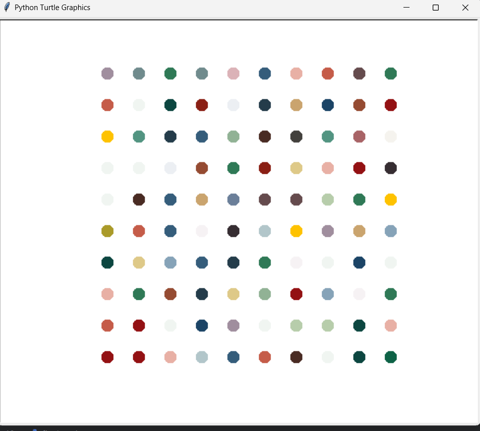

# Turtle Dots Art

This project uses Python's Turtle graphics to create an art piece made up of colored dots. The script randomly selects colors and arranges the dots in a grid pattern.

## Watch the Demo

[Click here to watch the demo video](https://youtu.be/w10FIHoBiT4)

